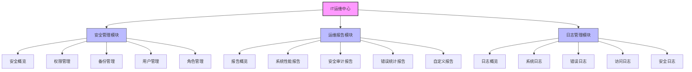

# IT运维中心概述

## 功能简介

IT运维中心是AlingAi_pro平台的核心管理模块，为系统管理员和IT运维人员提供全面的系统监控、安全管理、日志分析和报告功能。通过IT运维中心，管理员可以全面掌控系统运行状态，及时发现并解决潜在问题，确保系统的稳定、安全和高效运行。

## 功能架构

## 核心模块

IT运维中心包含以下核心功能模块：

### 安全管理

[安全管理模块](./security-management.md)提供全面的系统安全管理功能，包括：

- **安全概览**：系统安全状态的总体视图
- **权限管理**：精细控制用户对系统资源的访问权限
- **备份管理**：配置和执行系统数据备份策略
- **用户管理**：用户账号的全生命周期管理
- **角色管理**：基于角色的访问控制（RBAC）

### 运维报告

[运维报告模块](./reports-management.md)提供全面的系统运行状态报告功能，包括：

- **报告概览**：系统各类报告的汇总视图
- **系统性能报告**：系统各项性能指标的详细分析
- **安全审计报告**：系统安全状况的详细记录
- **错误统计报告**：系统错误和异常的汇总分析
- **自定义报告**：根据特定需求创建定制化报告

### 日志管理

[日志管理模块](./logs-management.md)提供全面的系统日志收集、存储、分析和管理功能，包括：

- **日志概览**：系统各类日志的汇总视图
- **系统日志**：操作系统和应用系统日志的管理
- **错误日志**：系统错误和异常的收集和分析
- **访问日志**：系统访问情况的记录和分析
- **安全日志**：与安全相关的日志收集和分析

## 主要特点

### 全面监控

IT运维中心提供全方位的系统监控功能，覆盖系统性能、安全状态、用户活动等各个方面，确保管理员能够全面了解系统运行状态。

### 实时告警

支持自定义告警规则，当系统出现异常或满足特定条件时，自动触发告警通知，确保管理员能够及时发现并解决潜在问题。

### 数据可视化

通过丰富的图表和仪表盘，将复杂的系统数据转化为直观的可视化展示，帮助管理员快速理解系统状态和趋势。

### 自动化运维

提供自动化运维工具和流程，减少手动操作，提高运维效率，降低人为错误风险。

### 安全合规

内置安全合规检查和审计功能，帮助系统满足各种安全标准和法规要求。

## 技术架构

IT运维中心采用模块化、可扩展的技术架构，主要组件包括：

- **数据采集层**：负责从各个系统组件收集运行数据
- **数据存储层**：高效存储和管理大量的运维数据
- **数据处理层**：对原始数据进行处理、分析和关联
- **可视化层**：将处理后的数据转化为直观的可视化展示
- **告警系统**：监控数据并根据规则触发告警
- **API接口**：提供与其他系统集成的接口

## 使用场景

IT运维中心适用于以下场景：

- **日常系统监控**：实时监控系统运行状态，及时发现并解决问题
- **安全事件响应**：快速检测和响应安全事件，减少安全风险
- **性能优化**：分析系统性能瓶颈，指导系统优化
- **合规审计**：生成合规审计报告，满足监管要求
- **容量规划**：分析系统资源使用趋势，指导容量规划

## 快速入门

要开始使用IT运维中心，请按照以下步骤操作：

1. 登录AlingAi_pro管理平台
2. 在左侧导航菜单中点击"IT运维中心"
3. 在运维中心首页查看系统概览
4. 根据需要进入各功能模块进行操作

更详细的使用指南，请参考各功能模块的文档：

- [安全管理](./security-management.md)
- [运维报告](./reports-management.md)
- [日志管理](./logs-management.md) 