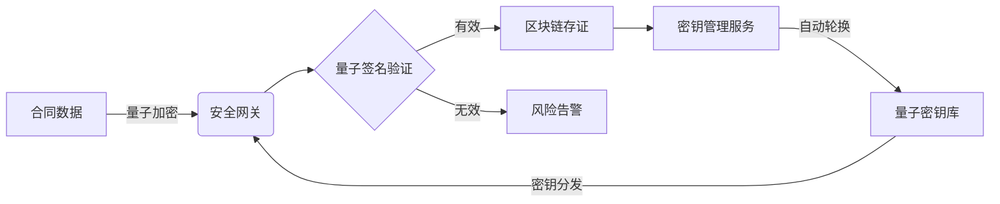

# Stanfai PHP 金融级安全框架


**企业级合同管理与电子签约解决方案**  
**版本**：2.5 | **最后更新**：2025-04-25

## ✨ 核心价值

- **量子安全加密**：支持Kyber1024/NTRU等抗量子算法
- **量子签名验证**：合同签署与API请求的量子级身份验证
- **密钥生命周期管理**：自动轮换与撤销量子密钥
- **区块链存证**：合同全生命周期可追溯、不可篡改
- **AI风控引擎**：实时检测异常行为与合同风险
- **全栈合规**：内置PCI DSS、GDPR等合规工具
- **高可用架构**：支持Kubernetes集群部署

## 🚀 快速开始

### 环境要求
```bash
# 基础环境
PHP >= 8.1 (推荐8.2)
MySQL >= 8.0 (或MariaDB 10.5+)
Composer >= 2.0
Redis >= 6.0 (推荐)

# 必需扩展
pdo, pdo_mysql, mbstring, sodium, gmp, redis
```

### 部署选项

#### 1. 使用install.php安装 (推荐)
```bash
git clone https://github.com/gxggm/stanfai-php.git
cd stanfai-php

# 运行安装程序
php install.php
```

**可选参数**:
- `--no-interaction`: 非交互模式(适用于自动化部署)
- `--debug`: 启用调试模式(记录详细日志)

**功能特点**:
✅ 自动环境检测  
✅ 交互式配置向导  
✅ 完整的依赖安装  
✅ 数据库自动迁移  
✅ 权限自动设置  

#### 2. 使用部署脚本
```bash
git clone https://github.com/gxggm/stanfai-php.git
cd stanfai-php

# 设置执行权限
chmod +x scripts/deploy.sh

# 运行部署脚本
./scripts/deploy.sh
```

#### 3. 传统安装方式
```bash
git clone https://github.com/gxggm/stanfai-php.git
cd stanfai-php

# 安装依赖
composer install --optimize-autoloader --no-dev

# 初始化环境
cp .env.example .env
php artisan key:generate

# 数据库迁移
php artisan migrate --seed
```

### 安装方式对比

| 特性               | install.php | 部署脚本 | 传统方式 | CNB 构建 |
|--------------------|------------|----------|----------|----------|
| 环境检测           | ✅          | ✅        | ❌        | ✅        |
| 交互式配置         | ✅          | ✅        | ❌        | ❌        |
| 自动化依赖安装     | ✅          | ✅        | ✅        | ✅        |
| 数据库自动迁移     | ✅          | ✅        | ✅        | ❌        |
| 权限自动设置       | ✅          | ✅        | ❌        | ✅        |
| 支持非交互模式     | ✅          | ✅        | ✅        | ✅        |
| 安装日志记录       | ✅          | ❌        | ❌        | ✅        |
| 容器化支持        | ❌          | ❌        | ❌        | ✅        |
| 生产环境优化       | ❌          | ✅        | ❌        | ✅        |

### Cloud Native Buildpacks 构建

#### 1. 本地构建
```bash
pack build ai-companion --path . --builder paketobuildpacks/builder:base
```

#### 2. 生产环境构建
```bash
pack build ai-companion:prod \
  --path . \
  --builder paketobuildpacks/builder:base \
  --env PHP_ENV=production \
  --env NODE_ENV=production
```

#### 3. CI/CD 集成
```yaml
# GitHub Actions 示例
- name: Build with CNB
  uses: docker/build-push-action@v4
  with:
    context: .
    push: true
    tags: your-registry/ai-companion:latest
    builder: paketobuildpacks/builder:base
```

#### 构建配置
- 编辑 `.cnb.yml` 文件自定义构建流程
- 支持 PHP 8.2 和 Node.js 18
- 自动安全扫描
- 生产环境优化

### 常见问题

❌ **数据库连接失败**  
✅ 检查`.env`中的DB_*配置，确保MySQL服务运行

❌ **加密服务异常**  
✅ 验证`sodium`扩展已安装，重启PHP服务

❌ **Redis连接超时**  
✅ 检查Redis服务状态和`.env`中的REDIS_*配置

❌ **量子加密初始化失败**  
✅ 确保系统时间准确，NTP服务同步正常

## 🔐 安全特性



**技术指标**：
- 单节点支持1000+ TPS合同签署
- 毫秒级风险检测响应
- 99.99%服务可用性

## 🏢 企业应用场景

### 银行电子合同系统
- **实施效果**：
  - 签署效率提升300%
  - 安全事件减少95%
  - 通过等保三级认证

### 政府公文系统
- **功能亮点**：
  - 国密算法支持
  - 多级审批流程
  - 安全审计追踪

## �️ 项目结构

```
stanfai-php/
├── security/          # 量子加密与安全模块
├── ai/                # AI风控引擎
├── blockchain/        # 区块链存证服务
├── services/          # 核心业务服务
├── middlewares/       # 安全中间件
├── tests/             # 压力测试(5000+TPS验证)
└── tools/             # 运维管理工具
```

## 📈 性能数据

| 场景          | 指标              | 优化方案         |
|---------------|-------------------|------------------|
| 合同签署      | 1200 TPS         | 批量处理+缓存    |
| 密钥生成      | 5000次/秒        | 硬件加速         |
| 风险检测      | <10ms延迟        | 模型优化         |

## 🔗 重要链接

- [完整文档](docs/architecture.md)
- [API参考](docs/api.md)
- [合规白皮书](docs/compliance.pdf)
- [演示系统](https://demo.gxggm.com)

## 🤝 联系我们

**技术服务**：  
📞 +86-400-888-9999  
� tech@gxggm.com  

**安全响应**：  
🔒 security@gxggm.com  
🔑 [PGP公钥](https://gxggm.com/pgp.asc)

---
*© 2023 广西港妙科技有限公司 - 保留所有权利*