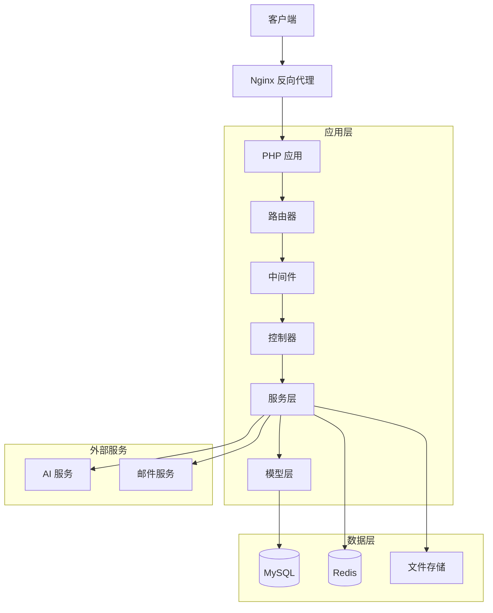
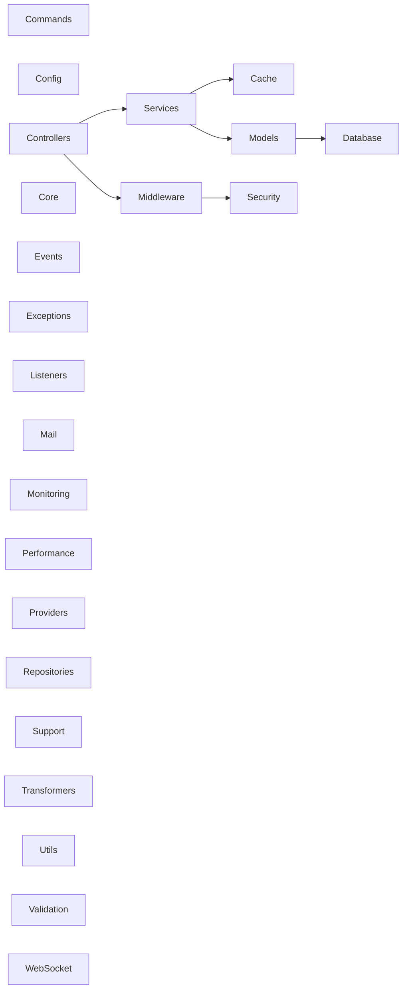

# AlingAi Pro 系统架构图

## 系统整体架构

```mermaid
graph TB
    Client[客户端] --> Nginx[Nginx 反向代理]
    Nginx --> App[PHP 应用]
    
    subgraph 应用层
        App --> Router[路由器]
        Router --> Middleware[中间件]
        Middleware --> Controllers[控制器]
        Controllers --> Services[服务层]
        Services --> Models[模型层]
    end
    
    subgraph 数据层
        Models --> Database[(MySQL)]
        Services --> Cache[(Redis)]
        Services --> Files[文件存储]
    end
    
    subgraph 外部服务
        Services --> AI[AI 服务]
        Services --> Email[邮件服务]
    end
```

## 模块依赖关系

```mermaid
graph LR
    Cache[Cache]
    Commands[Commands]
    Config[Config]
    Controllers[Controllers]
    Core[Core]
    Database[Database]
    Events[Events]
    Exceptions[Exceptions]
    Listeners[Listeners]
    Mail[Mail]
    Middleware[Middleware]
    Models[Models]
    Monitoring[Monitoring]
    Performance[Performance]
    Providers[Providers]
    Repositories[Repositories]
    Security[Security]
    Services[Services]
    Support[Support]
    Transformers[Transformers]
    Utils[Utils]
    Validation[Validation]
    WebSocket[WebSocket]
    Controllers --> Services
    Controllers --> Middleware
    Services --> Models
    Services --> Cache
    Models --> Database
    Middleware --> Security
```

