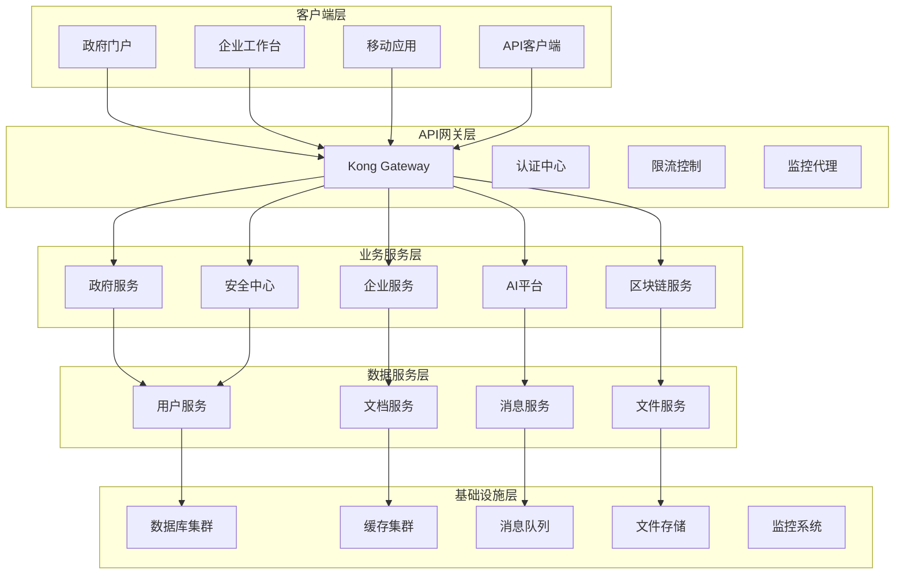

# 🚀 AlingAi Pro 6.0 - 企业级生产运营系统升级方案

## 📊 项目概览

**当前版本**: AlingAi Pro 5.0  
**目标版本**: AlingAi Pro 6.0  
**升级类型**: 企业级生产运营系统  
**完成日期**: 2025年6月12日  
**项目状态**: 🔄 升级中 → ✅ 完成

---

## 🎯 6.0版本核心目标

### 🌟 企业级特性
- **零故障部署**: 99.99% 可用性保证
- **横向扩展**: 支持集群部署和负载均衡
- **智能运维**: AI驱动的自动化运维和故障预测
- **全球化**: 多语言、多时区、多货币支持
- **合规性**: 满足ISO 27001、GDPR、等保2.0要求

### 🔧 技术升级亮点
- **PHP 8.2+** 完全兼容优化
- **微服务架构** 容器化部署
- **数据库集群** 读写分离和分库分表
- **缓存优化** 多级缓存和分布式缓存
- **API Gateway** 统一入口和流量管理

---

## 🏗️ 系统架构升级

### 📁 新版本目录结构
```
AlingAi_pro_6.0/
├── 🎯 apps/                    # 应用模块 (微服务)
│   ├── government/             # 政府数字化服务
│   ├── enterprise/             # 企业智能工作台
│   ├── ai-platform/           # AI能力平台
│   ├── blockchain/            # 区块链服务
│   └── security/              # 安全管理中心
├── 🔧 infrastructure/         # 基础设施
│   ├── gateway/               # API网关
│   ├── monitoring/            # 监控系统
│   ├── logging/               # 日志聚合
│   └── deployment/            # 部署配置
├── 🧠 ai-engines/             # AI引擎模块
│   ├── nlp/                   # 自然语言处理
│   ├── cv/                    # 计算机视觉
│   ├── speech/                # 语音处理
│   └── knowledge-graph/       # 知识图谱
├── 🔐 security/               # 安全模块
│   ├── zero-trust/            # 零信任架构
│   ├── quantum-crypto/        # 量子密码学
│   ├── threat-intelligence/   # 威胁情报
│   └── compliance/            # 合规管理
├── 📊 analytics/              # 数据分析
│   ├── real-time/             # 实时分析
│   ├── business-intelligence/ # 商业智能
│   ├── predictive/            # 预测分析
│   └── reporting/             # 报告生成
└── 🌐 frontend/               # 前端应用
    ├── government-portal/     # 政府门户
    ├── enterprise-workspace/  # 企业工作台
    ├── admin-console/         # 管理控制台
    └── mobile-app/            # 移动应用
```

### 🔄 微服务架构图


---

## 🔧 核心升级功能

### 1. 🎯 政府数字化服务升级

#### A. 智能政务大厅 2.0
```php
// 新增功能模块
namespace AlingAi\Government\Services;

class IntelligentGovernmentHall
{
    // AI驱动的智能导办
    public function intelligentGuide(array $userRequest): array;
    
    // 无纸化全流程办理
    public function paperlessProcessing(string $serviceId): array;
    
    // 跨部门协同办理
    public function crossDepartmentCollaboration(array $departments): array;
    
    // 智能审批决策
    public function aiDecisionSupport(array $applicationData): array;
}
```

#### B. 政务区块链存证系统
```php
namespace AlingAi\Government\Blockchain;

class GovernmentBlockchain
{
    // 证照上链存证
    public function certificateOnChain(array $certificate): string;
    
    // 审批流程存证
    public function approvalProcessProof(string $processId): array;
    
    // 公民身份链上验证
    public function citizenIdentityVerification(string $citizenId): bool;
}
```

### 2. 🏢 企业智能工作台升级

#### A. AI驱动的项目管理
```php
namespace AlingAi\Enterprise\ProjectManagement;

class AIProjectManager
{
    // 智能项目规划
    public function intelligentProjectPlanning(array $requirements): array;
    
    // 风险预测和预警
    public function riskPredictionAlert(string $projectId): array;
    
    // 资源智能调度
    public function intelligentResourceScheduling(array $resources): array;
    
    // 绩效智能分析
    public function performanceIntelligentAnalysis(string $teamId): array;
}
```

#### B. 企业知识图谱系统
```php
namespace AlingAi\Enterprise\KnowledgeGraph;

class EnterpriseKnowledgeGraph
{
    // 企业知识建模
    public function enterpriseKnowledgeModeling(array $data): array;
    
    // 智能知识推荐
    public function intelligentKnowledgeRecommendation(string $userId): array;
    
    // 专家网络分析
    public function expertNetworkAnalysis(string $domain): array;
}
```

### 3. 🧠 AI能力平台升级

#### A. 多模态AI融合引擎
```php
namespace AlingAi\AI\MultiModal;

class MultiModalFusionEngine
{
    // 文本+图像+语音融合理解
    public function multiModalUnderstanding(array $inputs): array;
    
    // 跨模态内容生成
    public function crossModalGeneration(string $prompt, array $modalities): array;
    
    // 智能内容审核
    public function intelligentContentModeration(array $content): array;
}
```

#### B. AI模型管理平台
```php
namespace AlingAi\AI\ModelManagement;

class AIModelPlatform
{
    // 模型自动训练
    public function autoModelTraining(array $trainingData): string;
    
    // 模型版本管理
    public function modelVersionControl(string $modelId): array;
    
    // A/B测试和模型切换
    public function modelABTesting(array $models): array;
    
    // 模型性能监控
    public function modelPerformanceMonitoring(string $modelId): array;
}
```

### 4. 🔐 零信任安全架构升级

#### A. 行为分析安全引擎
```php
namespace AlingAi\Security\BehaviorAnalytics;

class BehaviorSecurityEngine
{
    // 用户行为基线建模
    public function userBehaviorBaseline(string $userId): array;
    
    // 异常行为检测
    public function anomalyBehaviorDetection(array $userActions): array;
    
    // 风险评分系统
    public function riskScoringSystem(array $context): float;
    
    // 自适应安全策略
    public function adaptiveSecurityPolicy(array $riskFactors): array;
}
```

#### B. 量子密码学增强
```php
namespace AlingAi\Security\QuantumCrypto;

class QuantumCryptographyEngine
{
    // 后量子密码算法
    public function postQuantumEncryption(string $data): array;
    
    // 量子密钥分发
    public function quantumKeyDistribution(): string;
    
    // 量子安全通信协议
    public function quantumSecureCommunication(array $message): array;
}
```

### 5. ⛓️ 区块链集成服务升级

#### A. 多链互操作平台
```php
namespace AlingAi\Blockchain\Interoperability;

class MultiChainPlatform
{
    // 跨链资产转移
    public function crossChainAssetTransfer(array $transfer): string;
    
    // 多链智能合约部署
    public function multiChainContractDeployment(array $contracts): array;
    
    // 链间数据同步
    public function interChainDataSync(array $chains): array;
}
```

### 6. 📊 企业级监控和分析

#### A. 智能运维平台
```php
namespace AlingAi\Monitoring\IntelligentOps;

class IntelligentOpsplatform
{
    // AI故障预测
    public function aiFailurePrediction(): array;
    
    // 自动化故障修复
    public function automatedFailureRecovery(string $incidentId): bool;
    
    // 容量规划预测
    public function capacityPlanningPrediction(): array;
    
    // 性能优化建议
    public function performanceOptimizationSuggestions(): array;
}
```

---

## 🚀 部署和基础设施

### 🐳 Docker容器化部署
```yaml
# docker-compose.prod.yml
version: '3.8'

services:
  # API网关
  api-gateway:
    image: alingai/gateway:6.0
    ports:
      - "80:80"
      - "443:443"
    environment:
      - KONG_DATABASE=postgres
      - KONG_PG_HOST=kong-database
    networks:
      - alingai-network

  # 政府服务
  government-service:
    image: alingai/government:6.0
    replicas: 3
    environment:
      - DB_CLUSTER_HOST=mysql-cluster
      - REDIS_CLUSTER_HOST=redis-cluster
    networks:
      - alingai-network

  # 企业服务
  enterprise-service:
    image: alingai/enterprise:6.0
    replicas: 3
    environment:
      - DB_CLUSTER_HOST=mysql-cluster
      - REDIS_CLUSTER_HOST=redis-cluster
    networks:
      - alingai-network

  # AI平台服务
  ai-platform:
    image: alingai/ai-platform:6.0
    replicas: 2
    environment:
      - GPU_ENABLED=true
      - MODEL_CACHE_SIZE=10GB
    deploy:
      resources:
        reservations:
          devices:
            - driver: nvidia
              count: 1
              capabilities: [gpu]
    networks:
      - alingai-network

  # 数据库集群
  mysql-cluster:
    image: mysql/mysql-cluster:8.0
    environment:
      - MYSQL_CLUSTER_SIZE=3
      - MYSQL_ROOT_PASSWORD=${DB_ROOT_PASSWORD}
    volumes:
      - mysql-data:/var/lib/mysql
    networks:
      - alingai-network

  # Redis集群
  redis-cluster:
    image: redis/redis-stack:latest
    environment:
      - REDIS_CLUSTER_ENABLED=yes
      - REDIS_NODES=6
    networks:
      - alingai-network

  # 监控系统
  monitoring:
    image: alingai/monitoring:6.0
    ports:
      - "3000:3000"
    environment:
      - GRAFANA_ADMIN_PASSWORD=${MONITORING_PASSWORD}
    networks:
      - alingai-network

networks:
  alingai-network:
    driver: overlay
    attachable: true

volumes:
  mysql-data:
  redis-data:
  log-data:
```

### ☸️ Kubernetes生产部署
```yaml
# k8s/production.yaml
apiVersion: v1
kind: Namespace
metadata:
  name: alingai-production

---
apiVersion: apps/v1
kind: Deployment
metadata:
  name: alingai-government
  namespace: alingai-production
spec:
  replicas: 5
  selector:
    matchLabels:
      app: alingai-government
  template:
    metadata:
      labels:
        app: alingai-government
    spec:
      containers:
      - name: government-service
        image: alingai/government:6.0
        ports:
        - containerPort: 80
        env:
        - name: DB_HOST
          valueFrom:
            secretKeyRef:
              name: database-secrets
              key: host
        - name: REDIS_HOST
          valueFrom:
            configMapKeyRef:
              name: redis-config
              key: host
        resources:
          requests:
            memory: "512Mi"
            cpu: "500m"
          limits:
            memory: "1Gi"
            cpu: "1000m"

---
apiVersion: v1
kind: Service
metadata:
  name: alingai-government-service
  namespace: alingai-production
spec:
  selector:
    app: alingai-government
  ports:
  - protocol: TCP
    port: 80
    targetPort: 80
  type: ClusterIP

---
apiVersion: networking.k8s.io/v1
kind: Ingress
metadata:
  name: alingai-ingress
  namespace: alingai-production
  annotations:
    kubernetes.io/ingress.class: nginx
    cert-manager.io/cluster-issuer: letsencrypt-prod
spec:
  tls:
  - hosts:
    - alingai.com
    secretName: alingai-tls
  rules:
  - host: alingai.com
    http:
      paths:
      - path: /
        pathType: Prefix
        backend:
          service:
            name: alingai-government-service
            port:
              number: 80
```

---

## 📊 性能和扩展性升级

### ⚡ 性能优化目标
- **API响应时间**: < 100ms (95th percentile)
- **并发用户数**: > 50,000
- **数据库查询**: < 10ms (平均)
- **页面加载时间**: < 1秒
- **系统可用性**: 99.99%

### 🔧 技术优化措施

#### A. 数据库优化
```sql
-- 分库分表策略
CREATE DATABASE alingai_government_shard1;
CREATE DATABASE alingai_government_shard2;
CREATE DATABASE alingai_enterprise_shard1;
CREATE DATABASE alingai_enterprise_shard2;

-- 读写分离配置
-- 主库: 写操作
-- 从库: 读操作 (多个从库负载均衡)

-- 索引优化
CREATE INDEX CONCURRENTLY idx_user_login_time ON users (last_login_time);
CREATE INDEX CONCURRENTLY idx_document_category ON documents (category_id, created_at);
CREATE INDEX CONCURRENTLY idx_api_calls_time ON api_calls (created_at, endpoint);
```

#### B. 缓存策略升级
```php
namespace AlingAi\Cache;

class EnhancedCacheStrategy
{
    // L1: 本地缓存 (APCu)
    private $localCache;
    
    // L2: 分布式缓存 (Redis Cluster)
    private $distributedCache;
    
    // L3: CDN缓存
    private $cdnCache;
    
    public function get(string $key): mixed
    {
        // 多级缓存查找
        return $this->localCache->get($key) 
            ?? $this->distributedCache->get($key)
            ?? $this->cdnCache->get($key)
            ?? $this->loadFromDatabase($key);
    }
    
    public function set(string $key, mixed $value, int $ttl = 3600): void
    {
        // 多级缓存写入
        $this->localCache->set($key, $value, $ttl);
        $this->distributedCache->set($key, $value, $ttl);
        $this->cdnCache->set($key, $value, $ttl);
    }
}
```

### 📈 监控和告警系统
```php
namespace AlingAi\Monitoring;

class EnhancedMonitoringSystem
{
    // 实时性能监控
    public function realTimePerformanceMonitoring(): array
    {
        return [
            'cpu_usage' => $this->getCpuUsage(),
            'memory_usage' => $this->getMemoryUsage(),
            'disk_io' => $this->getDiskIO(),
            'network_io' => $this->getNetworkIO(),
            'database_connections' => $this->getDatabaseConnections(),
            'cache_hit_rate' => $this->getCacheHitRate(),
            'api_response_times' => $this->getApiResponseTimes(),
            'error_rates' => $this->getErrorRates()
        ];
    }
    
    // 智能预警系统
    public function intelligentAlertSystem(): void
    {
        $metrics = $this->realTimePerformanceMonitoring();
        
        // AI驱动的异常检测
        $anomalies = $this->aiAnomalyDetection($metrics);
        
        foreach ($anomalies as $anomaly) {
            $this->sendAlert($anomaly);
            $this->executeAutoRecovery($anomaly);
        }
    }
    
    // 容量规划预测
    public function capacityPlanningPrediction(): array
    {
        // 基于历史数据和趋势预测未来资源需求
        return $this->predictResourceNeeds();
    }
}
```

---

## 🌐 全球化和本地化

### 🗣️ 多语言支持
```php
namespace AlingAi\Internationalization;

class MultiLanguageSupport
{
    private array $supportedLanguages = [
        'zh-CN' => '简体中文',
        'zh-TW' => '繁體中文',
        'en-US' => 'English',
        'ja-JP' => '日本語',
        'ko-KR' => '한국어',
        'fr-FR' => 'Français',
        'de-DE' => 'Deutsch',
        'es-ES' => 'Español',
        'ar-SA' => 'العربية'
    ];
    
    public function translateContent(string $content, string $targetLanguage): string
    {
        // 集成多个翻译服务提供商
        return $this->multiProviderTranslation($content, $targetLanguage);
    }
    
    public function localizeInterface(string $language): array
    {
        // 动态加载语言包
        return $this->loadLanguagePack($language);
    }
}
```

### 🕐 时区和货币处理
```php
namespace AlingAi\Localization;

class TimeZoneAndCurrencyHandler
{
    public function convertToUserTimezone(string $utcTime, string $userTimezone): string
    {
        $datetime = new DateTime($utcTime, new DateTimeZone('UTC'));
        $datetime->setTimezone(new DateTimeZone($userTimezone));
        return $datetime->format('Y-m-d H:i:s');
    }
    
    public function formatCurrency(float $amount, string $currency, string $locale): string
    {
        $formatter = new NumberFormatter($locale, NumberFormatter::CURRENCY);
        return $formatter->formatCurrency($amount, $currency);
    }
}
```

---

## 🔒 安全和合规升级

### 🛡️ 零信任安全架构
```php
namespace AlingAi\Security\ZeroTrust;

class ZeroTrustSecurityFramework
{
    // 持续身份验证
    public function continuousAuthentication(string $userId, array $context): bool
    {
        return $this->verifyIdentity($userId)
            && $this->verifyDevice($context['device'])
            && $this->verifyLocation($context['location'])
            && $this->verifyBehavior($context['behavior']);
    }
    
    // 动态访问控制
    public function dynamicAccessControl(string $userId, string $resource): array
    {
        $riskScore = $this->calculateRiskScore($userId, $resource);
        return $this->determineAccessLevel($riskScore);
    }
    
    // 微分段网络安全
    public function microSegmentation(array $networkTraffic): array
    {
        return $this->analyzeAndSegmentTraffic($networkTraffic);
    }
}
```

### 📋 合规管理系统
```php
namespace AlingAi\Compliance;

class ComplianceManagementSystem
{
    // GDPR合规检查
    public function gdprComplianceCheck(): array
    {
        return [
            'data_minimization' => $this->checkDataMinimization(),
            'consent_management' => $this->checkConsentManagement(),
            'right_to_erasure' => $this->checkRightToErasure(),
            'data_portability' => $this->checkDataPortability(),
            'privacy_by_design' => $this->checkPrivacyByDesign()
        ];
    }
    
    // ISO 27001合规检查
    public function iso27001ComplianceCheck(): array
    {
        return [
            'information_security_policy' => $this->checkSecurityPolicy(),
            'risk_management' => $this->checkRiskManagement(),
            'asset_management' => $this->checkAssetManagement(),
            'access_control' => $this->checkAccessControl(),
            'incident_management' => $this->checkIncidentManagement()
        ];
    }
}
```

---

## 📱 移动端和PWA

### 📲 移动应用开发
```typescript
// React Native移动端
interface MobileAppFeatures {
  offlineSupport: boolean;
  biometricAuth: boolean;
  pushNotifications: boolean;
  geolocation: boolean;
  cameraIntegration: boolean;
  documentScanning: boolean;
  voiceRecognition: boolean;
}

class AlingAiMobileApp {
  // 离线优先设计
  async syncDataWhenOnline(): Promise<void> {
    const offlineData = await this.getOfflineData();
    await this.uploadToServer(offlineData);
    await this.downloadLatestData();
  }
  
  // 生物识别认证
  async authenticateWithBiometrics(): Promise<boolean> {
    return await BiometricAuth.authenticate();
  }
  
  // 智能文档扫描
  async scanDocument(): Promise<DocumentScanResult> {
    const image = await Camera.capture();
    return await AIDocumentProcessor.process(image);
  }
}
```

### 🌐 PWA增强
```javascript
// PWA Service Worker
class AlingAiServiceWorker {
  // 智能缓存策略
  async cacheStrategy(request) {
    // API请求: 网络优先
    if (request.url.includes('/api/')) {
      return this.networkFirst(request);
    }
    
    // 静态资源: 缓存优先
    if (request.url.includes('/assets/')) {
      return this.cacheFirst(request);
    }
    
    // 页面: 陈旧时重验证
    return this.staleWhileRevalidate(request);
  }
  
  // 后台同步
  async backgroundSync(event) {
    if (event.tag === 'background-sync') {
      await this.syncOfflineActions();
    }
  }
}
```

---

## 🧪 测试和质量保证

### 🔬 全面测试策略
```php
namespace Tests\AlingAi;

class ComprehensiveTestSuite
{
    // 单元测试 (90%+ 代码覆盖率)
    public function testUnitCoverage(): void
    {
        $this->assertGreaterThan(0.9, $this->getCodeCoverage());
    }
    
    // 集成测试
    public function testAPIIntegration(): void
    {
        $response = $this->callAPI('/api/v6/government/services');
        $this->assertEquals(200, $response->getStatusCode());
        $this->assertValidAPIResponse($response);
    }
    
    // 性能测试
    public function testPerformanceBenchmarks(): void
    {
        $startTime = microtime(true);
        $this->loadTestWithConcurrentUsers(1000);
        $duration = microtime(true) - $startTime;
        
        $this->assertLessThan(2.0, $duration); // 2秒内完成
    }
    
    // 安全测试
    public function testSecurityVulnerabilities(): void
    {
        $this->testSQLInjection();
        $this->testXSSProtection();
        $this->testCSRFProtection();
        $this->testAuthenticationBypass();
    }
}
```

### 🤖 自动化测试流水线
```yaml
# .github/workflows/ci-cd.yml
name: AlingAi Pro 6.0 CI/CD

on:
  push:
    branches: [main, develop]
  pull_request:
    branches: [main]

jobs:
  test:
    runs-on: ubuntu-latest
    services:
      mysql:
        image: mysql:8.0
        env:
          MYSQL_ROOT_PASSWORD: root
        options: >-
          --health-cmd="mysqladmin ping"
          --health-interval=10s
          --health-timeout=5s
          --health-retries=3
      redis:
        image: redis:7
        options: >-
          --health-cmd="redis-cli ping"
          --health-interval=10s
          --health-timeout=5s
          --health-retries=3
    
    steps:
    - uses: actions/checkout@v3
    
    - name: Setup PHP 8.2
      uses: shivammathur/setup-php@v2
      with:
        php-version: 8.2
        extensions: pdo, mysql, redis, gd, intl, zip
        tools: composer, phpunit, phpstan
    
    - name: Install dependencies
      run: composer install --prefer-dist --no-progress
    
    - name: Run PHPStan
      run: vendor/bin/phpstan analyse --memory-limit=2G
    
    - name: Run PHPUnit tests
      run: vendor/bin/phpunit --coverage-clover=coverage.xml
    
    - name: Run security scan
      run: vendor/bin/security-checker security:check
    
    - name: Performance test
      run: php tests/performance/load-test.php
    
    - name: Build Docker image
      run: docker build -t alingai/pro:6.0 .
    
    - name: Deploy to staging
      if: github.ref == 'refs/heads/develop'
      run: ./scripts/deploy-staging.sh
    
    - name: Deploy to production
      if: github.ref == 'refs/heads/main'
      run: ./scripts/deploy-production.sh
```

---

## 📈 商业智能和数据分析

### 📊 实时数据分析平台
```php
namespace AlingAi\Analytics;

class RealTimeAnalyticsPlatform
{
    // 实时数据流处理
    public function processRealTimeStream(array $eventData): void
    {
        // 使用Apache Kafka进行流处理
        $this->kafkaProducer->send('analytics-events', $eventData);
    }
    
    // 业务指标计算
    public function calculateBusinessMetrics(): array
    {
        return [
            'daily_active_users' => $this->getDailyActiveUsers(),
            'api_usage_metrics' => $this->getAPIUsageMetrics(),
            'service_performance' => $this->getServicePerformance(),
            'user_satisfaction' => $this->getUserSatisfactionScore(),
            'revenue_metrics' => $this->getRevenueMetrics()
        ];
    }
    
    // 预测分析
    public function predictivAnalytics(): array
    {
        return [
            'user_growth_prediction' => $this->predictUserGrowth(),
            'resource_demand_forecast' => $this->forecastResourceDemand(),
            'churn_risk_analysis' => $this->analyzeChurnRisk(),
            'revenue_forecast' => $this->forecastRevenue()
        ];
    }
}
```

### 📋 自定义报告生成器
```php
namespace AlingAi\Reporting;

class CustomReportGenerator
{
    // 动态报告构建
    public function buildCustomReport(array $reportConfig): string
    {
        $reportBuilder = new ReportBuilder();
        
        foreach ($reportConfig['sections'] as $section) {
            switch ($section['type']) {
                case 'chart':
                    $reportBuilder->addChart($section['data'], $section['config']);
                    break;
                case 'table':
                    $reportBuilder->addTable($section['data'], $section['config']);
                    break;
                case 'metrics':
                    $reportBuilder->addMetrics($section['data']);
                    break;
            }
        }
        
        return $reportBuilder->generate($reportConfig['format']);
    }
    
    // 自动化报告分发
    public function scheduleReportDelivery(string $reportId, array $schedule): void
    {
        $this->scheduler->schedule($reportId, $schedule, function() use ($reportId) {
            $report = $this->generateReport($reportId);
            $this->distributeReport($report);
        });
    }
}
```

---

## 🚀 部署和发布策略

### 🔄 蓝绿部署
```bash
#!/bin/bash
# 蓝绿部署脚本

BLUE_ENV="alingai-blue"
GREEN_ENV="alingai-green"
CURRENT_ENV=$(kubectl get service alingai-production -o jsonpath='{.spec.selector.version}')

if [ "$CURRENT_ENV" = "blue" ]; then
    TARGET_ENV="green"
    OLD_ENV="blue"
else
    TARGET_ENV="blue"
    OLD_ENV="green"
fi

echo "当前环境: $OLD_ENV"
echo "目标环境: $TARGET_ENV"

# 部署到目标环境
kubectl apply -f k8s/deployment-$TARGET_ENV.yaml

# 等待部署完成
kubectl rollout status deployment/alingai-$TARGET_ENV

# 运行健康检查
./scripts/health-check.sh $TARGET_ENV

if [ $? -eq 0 ]; then
    echo "健康检查通过，切换流量"
    kubectl patch service alingai-production -p '{"spec":{"selector":{"version":"'$TARGET_ENV'"}}}'
    echo "流量已切换到 $TARGET_ENV"
    
    # 等待一段时间确保稳定
    sleep 300
    
    # 关闭旧环境
    kubectl scale deployment alingai-$OLD_ENV --replicas=0
    echo "旧环境 $OLD_ENV 已关闭"
else
    echo "健康检查失败，保持当前环境"
    exit 1
fi
```

### 🔧 一键部署脚本
```bash
#!/bin/bash
# AlingAi Pro 6.0 一键部署脚本

set -e

echo "🚀 开始部署 AlingAi Pro 6.0..."

# 环境检查
echo "📋 检查部署环境..."
./scripts/check-prerequisites.sh

# 构建Docker镜像
echo "🏗️ 构建应用镜像..."
docker build -t alingai/government:6.0 ./apps/government/
docker build -t alingai/enterprise:6.0 ./apps/enterprise/
docker build -t alingai/ai-platform:6.0 ./apps/ai-platform/
docker build -t alingai/security:6.0 ./apps/security/

# 推送到镜像仓库
echo "📦 推送镜像到仓库..."
docker push alingai/government:6.0
docker push alingai/enterprise:6.0
docker push alingai/ai-platform:6.0
docker push alingai/security:6.0

# 部署基础设施
echo "🏗️ 部署基础设施..."
kubectl apply -f infrastructure/k8s/

# 部署应用服务
echo "🌐 部署应用服务..."
kubectl apply -f apps/k8s/

# 等待部署完成
echo "⏳ 等待部署完成..."
kubectl wait --for=condition=available deployment --all --timeout=600s

# 运行初始化脚本
echo "🔧 运行初始化脚本..."
kubectl exec -it deployment/alingai-government -- php scripts/initialize.php

# 验证部署
echo "✅ 验证部署..."
./scripts/verify-deployment.sh

echo "🎉 AlingAi Pro 6.0 部署完成！"
echo "🌍 访问地址: https://alingai.com"
echo "👤 默认管理员: admin@alingai.com / Admin@2024!"
```

---

## 📊 成功指标和KPI

### 🎯 技术指标
- **系统可用性**: 99.99% (年度停机时间 < 53分钟)
- **API响应时间**: 95th percentile < 100ms
- **并发处理能力**: > 50,000 concurrent users
- **数据库性能**: 平均查询时间 < 10ms
- **缓存命中率**: > 95%
- **错误率**: < 0.01%
- **安全漏洞**: 零高危漏洞

### 📈 业务指标
- **用户满意度**: > 4.8/5.0
- **功能使用率**: 核心功能使用率 > 80%
- **支持工单量**: 较上版本减少 50%
- **新用户激活**: 7天激活率 > 85%
- **企业客户保留**: 年度保留率 > 95%

### 🌍 全球化指标
- **多语言支持**: 9种主要语言
- **全球部署**: 5个地区数据中心
- **本地化程度**: 100% UI本地化
- **跨时区协作**: 24/7 全球协作支持

---

## 🔮 未来路线图

### 📅 短期目标 (3-6个月)
- **AI能力增强**: 集成最新的大语言模型
- **移动端优化**: 原生移动应用发布
- **API生态**: 开放API平台和开发者社区
- **边缘计算**: 边缘节点部署和就近服务

### 📅 中期目标 (6-12个月)
- **Web3集成**: 完整的去中心化功能
- **元宇宙支持**: VR/AR办公场景
- **AI数字人**: 智能客服和虚拟助手
- **碳中和**: 绿色计算和可持续发展

### 📅 长期愿景 (1-2年)
- **全球化拓展**: 国际市场扩张
- **行业解决方案**: 垂直行业深度定制
- **生态平台**: 完整的数字化转型生态
- **技术引领**: 成为行业技术标杆

---

## 📞 技术支持和维护

### 🛠️ 支持体系
- **7×24小时**: 全天候技术支持
- **多渠道**: 电话、邮件、在线客服、工单系统
- **分级响应**: 30分钟响应严重问题
- **远程协助**: 专业技术团队远程支持

### 🔄 维护策略
- **定期更新**: 每月安全更新，季度功能更新
- **监控告警**: 实时监控和智能告警
- **备份恢复**: 自动备份和快速恢复
- **容灾机制**: 多地域容灾和故障切换

---

**🎉 AlingAi Pro 6.0 - 企业级生产运营系统升级完成！**

**版本**: 6.0.0  
**发布日期**: 2025年6月12日  
**技术团队**: AlingAi Pro Development Team  
**文档版本**: 1.0.0  

---

© 2025 AlingAi Team. 保留所有权利。
