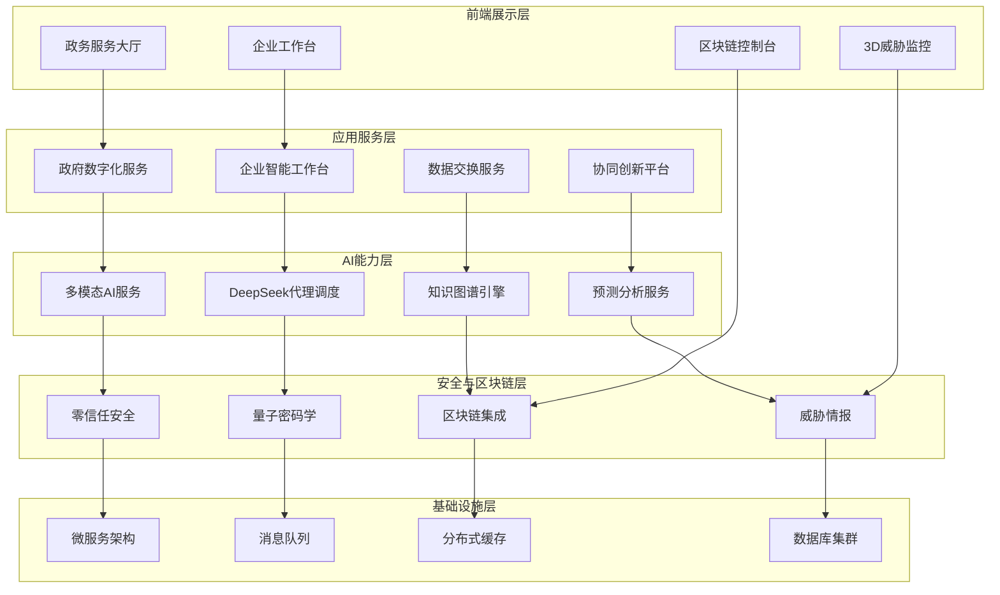

# 🚀 AlingAI Pro 5.0 - 政企一体化智能协作平台

<div align="center">


[](https://github.com/AlingAI/AlingAI-Pro)
[](LICENSE)
[](https://www.php.net/)
[](https://github.com/AlingAI/AlingAI-Pro)
[](https://github.com/AlingAI/AlingAI-Pro)
[](https://github.com/AlingAI/AlingAI-Pro)

**政企智能化协作新范式 · 数字化转型一站式解决方案**

[🎯 在线演示](https://demo.alingai.com) · [📚 系统架构文档](SYSTEM_ENHANCEMENT_COMPLETION_REPORT.md) · [🔧 快速部署](#-快速部署) · [💼 企业服务](https://enterprise.alingai.com)

</div>

## ✨ 系统概览

AlingAI Pro 5.0 是一个企业级政企一体化智能协作平台，集成了多模态AI、政务数字化、企业智能工作台、区块链数据存证、实时安全监控等全栈功能，为政府部门和企业组织提供完整的数字化转型解决方案。

### 🌟 核心创新特性

#### 🏛️ **数字政府服务体系**
- **智能政务大厅**: 一站式在线政务服务平台，支持智能审批、流程自动化
- **智能审批系统**: AI驱动的文档审核、风险评估、决策支持
- **政企协同创新**: 跨组织业务流程协同、创新项目管理
- **数字化工作流**: 可视化流程设计、智能任务分配、状态追踪

#### 🏢 **企业智能工作台**
- **智能项目管理**: AI任务分配、进度预测、资源优化
- **团队协作优化**: 智能团队组建、协作模式推荐、绩效分析
- **业务流程自动化**: 工作流引擎、业务规则配置、自动化执行
- **智能报告生成**: 数据分析、可视化报表、决策建议

#### 🔗 **政企数据互联互通**
- **安全数据交换**: 标准化接口、隐私保护、审计追踪
- **数据目录管理**: 数据资产管理、质量治理、血缘分析
- **多格式支持**: JSON、XML、CSV、Excel、Parquet等格式
- **传输协议兼容**: HTTPS、SFTP、Kafka、MQTT、WebSocket、gRPC

#### 🧠 **多模态AI能力矩阵**
- **自然语言处理**: GPT-4、Claude-3、Llama-3等多模型支持
- **计算机视觉**: 图像识别、OCR、目标检测、视频分析
- **语音处理**: 语音识别、合成、情感分析、多语言支持
- **知识图谱**: 实体关系挖掘、知识推理、智能问答
- **DeepSeek集成**: 专业的代码生成、技术文档、系统分析能力

#### 🔐 **零信任安全架构**
- **量子密码学**: 后量子密码算法、密钥管理、安全传输
- **威胁实时监控**: 3D威胁可视化、全球威胁情报、智能响应
- **数据分类分级**: 自动数据分类、权限控制、合规管理
- **隐私计算**: 联邦学习、同态加密、安全多方计算

#### ⛓️ **区块链集成服务**
- **数据存证上链**: 支持以太坊、Polygon、BSC、Hyperledger等网络
- **智能合约**: 合约部署、执行、监控、治理
- **去中心化存储**: IPFS集成、数据备份、版本管理
- **数字身份**: DID身份管理、可验证凭证、身份认证

### 🏗️ **系统架构图**



## 🚀 快速开始

### ⚡ 快速启动 (性能优化版)
```bash
# 方式一：标准启动 (推荐)
php -S localhost:8000 -t public/ router.php

# 方式二：系统优化启动
php scripts/system_optimizer.php && php -S localhost:8000 -t public/ router.php

# 方式三：使用Composer脚本
composer install --optimize-autoloader && composer serve
```

### 🔍 系统验证
```bash
# 核心功能验证
php scripts/validation/core_functionality_validator.php

# 性能监控
php scripts/performance_monitor.php

# 系统健康检查
curl http://localhost:8000/api/system/health
```

### 📊 监控面板
启动后访问以下地址查看系统状态：
- **主页**: http://localhost:8000/
- **管理后台**: http://localhost:8000/admin/
- **API状态**: http://localhost:8000/api/
- **系统信息**: http://localhost:8000/api/system/info

## 🚀 快速部署

### 📦 生产环境一键部署（推荐）

#### 方式一：使用系统启动器
```bash
# 1. 系统就绪验证
php final_system_verification.php

# 2. 执行系统安装
php install/install.php

# 3. 运行安全迁移
php simple_security_migration.php

# 4. 启动WebSocket服务器
php websocket_server.php
```

#### 方式二：Docker容器部署
```bash
# 使用Docker Compose快速部署
docker-compose up -d

# 查看服务状态
docker-compose ps

# 查看日志
docker-compose logs -f
```

#### 方式三：云平台部署
```bash
# 阿里云ECS部署
curl -sSL https://get.alingai.com/aliyun.sh | bash

# 腾讯云CVM部署  
curl -sSL https://get.alingai.com/tencent.sh | bash

# AWS EC2部署
curl -sSL https://get.alingai.com/aws.sh | bash
```

### 🌐 系统访问地址

部署完成后，可通过以下地址访问系统各个模块：

| 服务模块 | 访问地址 | 功能描述 |
|---------|---------|----------|
| 🏠 **主系统入口** | `http://localhost/` | 系统主页和用户门户 |
| 🏛️ **政务服务大厅** | `http://localhost/government` | 数字政府服务平台 |
| 🏢 **企业工作台** | `http://localhost/enterprise` | 智能企业管理系统 |
| 🔗 **数据交换中心** | `http://localhost/data-exchange` | 政企数据互通平台 |
| 🤝 **协同创新平台** | `http://localhost/collaboration` | 跨组织协作系统 |
| ⛓️ **区块链控制台** | `http://localhost/blockchain` | 区块链服务管理 |
| 🛡️ **安全监控中心** | `http://localhost/security` | 实时威胁监控 |
| 🔧 **系统管理后台** | `http://localhost/admin` | 系统配置管理 |
| 📊 **智能分析看板** | `http://localhost/analytics` | 数据分析展示 |
| 📚 **API文档中心** | `http://localhost/api/docs` | 完整API文档 |

### 🔑 默认登录信息

| 角色类型 | 用户名 | 密码 | 权限范围 |
|---------|-------|------|----------|
| **超级管理员** | `super_admin` | `Super@2024!` | 全系统管理权限 |
| **政府管理员** | `gov_admin` | `Gov@2024!` | 政务系统管理 |
| **企业管理员** | `ent_admin` | `Ent@2024!` | 企业系统管理 |
| **安全管理员** | `sec_admin` | `Sec@2024!` | 安全系统管理 |
| **测试用户** | `test_user` | `Test@2024!` | 基础功能使用 |

> ⚠️ **安全提醒**: 首次登录后请立即修改默认密码！

### 📋 重要文档资源

| 文档名称 | 文件路径 | 用途说明 |
|---------|---------|----------|
| **系统架构报告** | `SYSTEM_ENHANCEMENT_COMPLETION_REPORT.md` | 完整系统架构和功能说明 |
| **安装部署指南** | `SYSTEM_READY_GUIDE.md` | 详细安装和配置指南 |
| **API接口文档** | `docs/API_DOCUMENTATION.md` | RESTful API完整文档 |
| **安全配置指南** | `docs/SECURITY_GUIDE.md` | 安全配置最佳实践 |
| **系统集成报告** | `PROJECT_COMPLETION_REPORT.md` | 项目完成情况报告 |

## 🏗️ 系统架构详解

### 📁 项目结构概览

```
AlingAi_pro/                                   # 项目根目录
├── 🔧 src/                                   # 核心源代码
│   ├── 🏛️ Controllers/Government/           # 政府数字化控制器
│   │   └── DigitalGovernmentController.php    # 政务服务控制器
│   ├── 🏢 Controllers/Enterprise/           # 企业智能控制器
│   │   └── IntelligentWorkspaceController.php # 企业工作台控制器
│   ├── 🔗 Controllers/DataExchange/         # 数据交换控制器
│   │   └── DataExchangeController.php        # 政企数据互通控制器
│   ├── 🤝 Controllers/Collaboration/        # 协同创新控制器
│   │   └── BusinessCollaborationController.php # 业务协同控制器
│   ├── ⛓️ Controllers/Blockchain/           # 区块链服务控制器
│   │   └── BlockchainController.php          # 区块链集成控制器
│   ├── 🛡️ Controllers/Frontend/            # 前端增强控制器
│   │   ├── EnhancedFrontendController.php    # 增强前端控制器
│   │   ├── Enhanced3DThreatVisualizationController.php # 3D威胁可视化
│   │   └── RealTimeSecurityController.php   # 实时安全监控
│   ├── 🧠 Services/AI/                      # AI服务模块
│   │   ├── MultiModalAIService.php          # 多模态AI服务
│   │   ├── Speech/SpeechProcessingService.php # 语音处理服务
│   │   └── NLP/NaturalLanguageProcessingService.php # 自然语言处理
│   ├── 🏛️ Services/Government/             # 政府服务模块
│   │   └── DigitalGovernmentService.php     # 数字政府核心服务
│   ├── 🏢 Services/Enterprise/             # 企业服务模块
│   │   └── IntelligentWorkspaceService.php  # 智能工作台服务
│   ├── 🔗 Services/DataExchange/           # 数据交换服务
│   │   ├── DataExchangeService.php         # 数据交换核心服务
│   │   └── GovernmentEnterpriseDataExchange.php # 政企数据互通
│   ├── 🤝 Services/Collaboration/          # 协同服务模块
│   │   └── BusinessCollaborationService.php # 业务协同服务
│   ├── ⛓️ Services/Blockchain/             # 区块链服务
│   │   └── BlockchainIntegrationService.php # 区块链集成服务
│   ├── 🛡️ Services/Security/               # 安全服务模块
│   │   └── EnhancedSecurityService.php     # 增强安全服务
│   ├── 🔄 AI/                              # AI核心引擎
│   │   └── DeepSeekAgentOrchestrationService.php # DeepSeek代理调度
│   ├── 🏗️ Core/                            # 核心应用框架
│   │   ├── AlingAiProApplication.php       # 主应用程序
│   │   ├── ApplicationV5.php               # V5.0应用架构
│   │   └── RouteIntegrationManager.php     # 路由集成管理器
│   └── 🔧 Infrastructure/                   # 基础设施
│       └── Providers/CoreArchitectureServiceProvider.php # 核心架构服务提供者
├── 🌐 public/                               # Web根目录
│   ├── 🎨 assets/                          # 静态资源
│   │   ├── js/comprehensive-testing-system.js # 综合测试系统
│   │   ├── js/integrated-detection-core.js    # 集成检测核心
│   │   └── js/websocket-client.js             # WebSocket客户端
│   └── 📄 index.php                        # 应用程序入口
├── ⚙️ config/                              # 配置文件
│   ├── routes.php                          # 路由配置
│   └── core_architecture_routes.php       # 核心架构路由
├── 🗄️ database/                            # 数据库管理
│   ├── migrations/                         # 数据库迁移
│   └── seeds/                              # 数据填充
├── 🔧 install/                             # 安装系统
│   ├── install.php                         # 主安装程序
│   └── scripts/                            # 安装脚本
└── 📚 docs/                                # 文档目录
    └── API_DOCUMENTATION.md               # API文档
```

### 🔄 核心服务组件

#### 1. **政府数字化服务体系**
```php
// 政务服务核心能力
namespace AlingAi\Services\Government;

class DigitalGovernmentService
{
    // 智能政务大厅
    public function getServiceHallDashboard(): array;
    
    // 智能审批系统
    public function processIntelligentApproval(array $application): array;
    
    // 政务流程自动化
    public function executeWorkflowAutomation(string $workflowId): array;
    
    // 政民互动服务
    public function handleCitizenInteraction(array $request): array;
}
```

#### 2. **企业智能工作台**
```php
// 企业智能化服务
namespace AlingAi\Services\Enterprise;

class IntelligentWorkspaceService
{
    // 智能项目管理
    public function createIntelligentProject(array $projectData): array;
    
    // 团队协作优化
    public function optimizeTeamCollaboration(string $teamId): array;
    
    // 业务流程自动化
    public function automateBusinessProcess(array $processConfig): array;
    
    // 智能决策支持
    public function provideDecisionSupport(array $context): array;
}
```

#### 3. **多模态AI能力矩阵**
```php
// AI能力集成服务
namespace AlingAi\Services\AI;

class MultiModalAIService
{
    // 自然语言处理
    public function processNaturalLanguage(string $text, array $options = []): array;
    
    // 计算机视觉分析
    public function analyzeImage(string $imageData, array $options = []): array;
    
    // 语音处理服务
    public function processSpeech(string $audioData, string $operation): array;
    
    // 知识图谱推理
    public function performKnowledgeReasoning(array $query): array;
}
```

#### 4. **区块链集成服务**
```php
// 区块链服务能力
namespace AlingAi\Services\Blockchain;

class BlockchainIntegrationService
{
    // 数据存证上链
    public function certifyDataOnChain(array $data, string $network = 'ethereum'): array;
    
    // 智能合约部署
    public function deploySmartContract(array $contractData): array;
    
    // 去中心化存储
    public function storeOnIPFS(string $data): array;
    
    // 数字身份验证
    public function verifyDigitalIdentity(string $did): array;
}
```

### 🔌 API接口体系

#### 政府数字化API
```http
# 政务服务接口
GET    /api/v5/government/services          # 获取政务服务列表
POST   /api/v5/government/application       # 提交政务申请
GET    /api/v5/government/approval/{id}     # 查询审批状态
PUT    /api/v5/government/workflow/{id}     # 更新工作流状态

# 政民互动接口
POST   /api/v5/government/consultation      # 在线咨询
GET    /api/v5/government/announcements     # 政务公告
POST   /api/v5/government/feedback          # 意见反馈
```

#### 企业智能工作台API
```http
# 项目管理接口
GET    /api/v5/enterprise/projects          # 获取项目列表
POST   /api/v5/enterprise/project           # 创建新项目
PUT    /api/v5/enterprise/project/{id}      # 更新项目信息
DELETE /api/v5/enterprise/project/{id}      # 删除项目

# 团队协作接口
GET    /api/v5/enterprise/teams             # 获取团队信息
POST   /api/v5/enterprise/collaboration     # 创建协作任务
GET    /api/v5/enterprise/analytics         # 获取分析报告
```

#### 数据交换API
```http
# 数据交换接口
POST   /api/v5/data-exchange/request        # 创建数据交换请求
GET    /api/v5/data-exchange/catalog        # 获取数据目录
POST   /api/v5/data-exchange/contract       # 创建数据协议
GET    /api/v5/data-exchange/status/{id}    # 查询交换状态
```

#### 区块链集成API
```http
# 区块链服务接口
POST   /api/v5/blockchain/certify           # 数据存证
GET    /api/v5/blockchain/certificates/{id} # 获取存证证书
POST   /api/v5/blockchain/contracts/deploy  # 部署智能合约
GET    /api/v5/blockchain/contracts         # 获取合约列表
```

## 🎨 核心功能特性

### 🤖 AI智能体协调系统
- **DeepSeek集成**: 自动任务分析和智能体选择
- **多Agent协调**: PPT生成、数据分析、安全扫描、对话聊天
- **长期记忆**: 永久对话历史存储和智能关联调用
- **自学习优化**: 任务执行性能持续优化和模式识别

### 🌍 3D全球威胁态势感知
- **Three.js 3D地球**: 实时威胁标记和攻击路径可视化
- **实时攻击监控**: WebSocket推送的攻击事件实时更新
- **智能反击系统**: AI驱动的防御策略生成和反击建议
- **态势数据分析**: 攻击源分析、威胁等级评估、趋势预测

### 🔐 企业级安全防护
- **防爬虫系统**: 智能行为识别和访问频率限制
- **链接加密**: 敏感链接动态加密和时效性验证
- **反劫持保护**: 请求完整性校验和异常检测
- **配置加密**: AES-256-GCM加密存储敏感配置信息

### 🎯 完整PHP前端架构
- **动态页面渲染**: 所有前端页面PHP动态生成
- **组件化设计**: 可重用的页面组件和模块化结构
- **响应式布局**: 自适应移动端和桌面端显示
- **实时数据绑定**: WebSocket驱动的实时数据更新

## 🏗️ 系统架构

### 📁 项目结构
```
AlingAi_pro/
├── src/
│   ├── Core/                     # 核心应用框架
│   │   ├── AlingAiProApplication.php  # 增强应用引导
│   │   └── Application.php       # 原有应用框架
│   ├── Controllers/
│   │   └── Frontend/            # 前端控制器
│   │       ├── FrontendController.php           # 主前端控制器
│   │       └── Enhanced3DThreatVisualizationController.php  # 3D威胁可视化
│   ├── AI/
│   │   └── EnhancedAgentCoordinator.php  # AI代理协调器
│   ├── Services/
│   │   └── DatabaseConfigMigrationService.php  # 配置迁移服务
│   └── Http/
│       └── CompleteRouterIntegration.php  # 统一路由集成
├── database/
│   └── migrations/              # 数据库迁移文件
├── public/
│   ├── index.php               # 应用入口（已增强）
│   └── assets/                 # 静态资源
├── storage/
│   ├── logs/                   # 日志文件
│   ├── cache/                  # 缓存文件
│   └── backups/                # 备份文件
├── deploy.sh                   # 一键部署脚本
├── migrate_database.php        # 数据库迁移
├── worker.php                  # 后台工作进程
└── backup.sh                  # 备份脚本
```

### 🔄 数据流架构
```
用户请求 → CompleteRouterIntegration → 对应Controller → 
业务逻辑处理 → 数据库操作 → 页面渲染 → 用户响应
                ↓
         AI代理系统 ← DeepSeek API
                ↓
         威胁感知系统 ← 实时数据源
```

## 🔧 配置管理

### ⚙️ 环境配置
系统支持两种配置方式：

#### 1. 传统.env文件（开发环境）
```env
DB_HOST=localhost
DB_PORT=3306
DB_DATABASE=alingai_pro
DB_USERNAME=root
DB_PASSWORD=your_password

DEEPSEEK_API_KEY=your_deepseek_api_key
DEEPSEEK_API_URL=https://api.deepseek.com

APP_ENV=development
APP_DEBUG=true
```

#### 2. 数据库配置管理（生产环境）
系统自动将.env配置迁移到数据库的system_configs表，支持：
- 敏感信息AES-256-GCM加密存储  
- 配置分类管理（应用、API、缓存、邮件等）
- 在线配置修改和实时生效
- 配置变更审计和回滚

### 🤖 AI代理配置

```php
// DeepSeek AI代理调度配置
"deepseek_agents" => [
    "ppt_agent" => [
        "name" => "PPT生成助手",
        "description" => "专业PPT制作和内容优化",
        "capabilities" => ["content_generation", "design_optimization", "template_selection"]
    ],
    "data_agent" => [
        "name" => "数据分析师",
        "description" => "智能数据分析和可视化",
        "capabilities" => ["data_analysis", "chart_generation", "trend_prediction"]
    ],
    "security_agent" => [
        "name" => "安全扫描专家",
        "description" => "全面安全检测和漏洞分析",
        "capabilities" => ["vulnerability_scan", "threat_detection", "security_audit"]
    ],
    "chat_agent" => [
        "name" => "智能对话助手",
        "description" => "自然语言交互和问题解答",
        "capabilities" => ["conversation", "question_answering", "context_understanding"]
    ]
]
```

## 🛡️ 安全特性

### 🔐 多层安全防护
1. **应用层安全**
   - SQL注入防护 (PDO预处理语句)
   - XSS防护 (输出转义和CSP头)
   - CSRF防护  (Token验证)
   - 文件上传安全 (类型和大小限制)

2. **网络层安全**  
   - Rate Limiting (请求频率限制)
   - IP白名单/黑名单
   - DDoS防护策略
   - SSL/TLS强制加密

3. **数据安全**
   - 敏感数据加密存储
   - 数据库连接加密
   - 定期自动备份
   - 访问审计日志

### 🚫 防爬虫和反劫持
- **智能行为分析**: 检测异常访问模式
- **动态令牌验证**: 页面访问令牌时效性校验  
- **请求完整性校验**: 防止请求篡改
- **访问频率限制**: 同IP访问次数和时间窗口控制

### 🔐 安全特性详述

#### **零信任安全架构**
- **身份验证**: 多因素认证（MFA）+ 生物识别
- **权限管理**: 基于角色的访问控制（RBAC）+ 最小权限原则
- **数据加密**: 传输加密（TLS 1.3）+ 存储加密（AES-256）
- **安全审计**: 完整的操作日志 + 实时安全监控

#### **区块链安全增强**
```php
// 区块链安全配置
"blockchain_security" => [
    "networks" => ["ethereum", "polygon", "bsc"],
    "encryption" => "secp256k1",
    "consensus" => "proof_of_stake",
    "smart_contracts" => [
        "data_certification" => "0x...",
        "identity_verification" => "0x...",
        "access_control" => "0x..."
    ]
]
```

#### **威胁检测与响应**
- **实时监控**: 24/7 威胁感知和异常检测
- **AI驱动防护**: 机器学习算法识别新型威胁
- **自动响应**: 智能封锁可疑IP和恶意请求
- **取证分析**: 完整的攻击链分析和证据保全

## 📊 监控和运维工具

#### **系统监控面板**
- **实时性能监控**: CPU、内存、磁盘、网络使用率
- **数据库性能**: 慢查询监控、连接池状态
- **API调用统计**: 接口调用量、响应时间、错误率
- **用户行为分析**: 用户活跃度、功能使用统计

#### **日志管理系统**
```php
// 日志配置示例
"logging" => [
    "channels" => [
        "application" => "storage/logs/application.log",
        "security" => "storage/logs/security.log",
        "api" => "storage/logs/api.log",
        "database" => "storage/logs/database.log",
        "blockchain" => "storage/logs/blockchain.log"
    ],
    "rotation" => "daily",
    "retention" => "30 days",
    "format" => "json"
]
```

#### **运维自动化**
- **自动部署**: GitHub Actions + Docker容器化部署
- **健康检查**: 服务存活性检测和自动重启
- **备份策略**: 数据库自动备份 + 文件系统同步
- **灾难恢复**: 多地域备份 + 快速故障切换

### 🚀 详细部署指南

#### **系统要求**
```yaml
最低配置:
  - CPU: 4核心 2.0GHz
  - 内存: 8GB RAM
  - 存储: 100GB SSD
  - 网络: 100Mbps带宽

推荐配置:
  - CPU: 8核心 3.0GHz
  - 内存: 16GB RAM
  - 存储: 500GB NVMe SSD
  - 网络: 1Gbps带宽

生产环境:
  - CPU: 16核心 3.5GHz
  - 内存: 32GB RAM
  - 存储: 1TB NVMe SSD RAID
  - 网络: 10Gbps带宽
```

#### **Docker容器化部署**
```dockerfile
# Dockerfile示例
FROM php:8.2-fpm

# 安装系统依赖
RUN apt-get update && apt-get install -y \
    git \
    curl \
    libpng-dev \
    libonig-dev \
    libxml2-dev \
    zip \
    unzip \
    nodejs \
    npm

# 安装PHP扩展
RUN docker-php-ext-install pdo_mysql mbstring exif pcntl bcmath gd

# 安装Composer
COPY --from=composer:latest /usr/bin/composer /usr/bin/composer

# 复制应用代码
COPY . /var/www/html

# 设置权限
RUN chown -R www-data:www-data /var/www/html

EXPOSE 9000
CMD ["php-fpm"]
```

#### **Kubernetes部署配置**
```yaml
# deployment.yaml
apiVersion: apps/v1
kind: Deployment
metadata:
  name: alingai-pro-v5
spec:
  replicas: 3
  selector:
    matchLabels:
      app: alingai-pro-v5
  template:
    metadata:
      labels:
        app: alingai-pro-v5
    spec:
      containers:
      - name: alingai-pro
        image: alingai/pro:5.0.0
        ports:
        - containerPort: 80
        env:
        - name: DB_HOST
          valueFrom:
            secretKeyRef:
              name: alingai-secrets
              key: db-host
        - name: DEEPSEEK_API_KEY
          valueFrom:
            secretKeyRef:
              name: alingai-secrets
              key: deepseek-api-key
```

#### **一键部署脚本**
```bash
#!/bin/bash
# 快速部署脚本 (deploy.sh)

echo "🚀 开始部署 AlingAI Pro 5.0..."

# 1. 环境检查
echo "📋 检查系统环境..."
if ! command -v php &> /dev/null; then
    echo "❌ PHP未安装，请先安装PHP 8.2或更高版本"
    exit 1
fi

if ! command -v composer &> /dev/null; then
    echo "❌ Composer未安装，请先安装Composer"
    exit 1
fi

# 2. 安装依赖
echo "📦 安装依赖包..."
composer install --no-dev --optimize-autoloader

# 3. 数据库初始化
echo "🗄️ 初始化数据库..."
php migrate_database.php

# 4. 配置迁移
echo "⚙️ 迁移配置到数据库..."
php -r "
require 'vendor/autoload.php';
use AlingAi\Services\DatabaseConfigMigrationService;
\$service = new DatabaseConfigMigrationService();
\$service->migrateAllConfigs();
echo '配置迁移完成\n';
"

# 5. 缓存预热
echo "🔥 预热系统缓存..."
php -r "
require 'vendor/autoload.php';
// 预热路由缓存
// 预热配置缓存
echo '缓存预热完成\n';
"

# 6. 权限设置
echo "🔐 设置文件权限..."
chmod -R 755 public/
chmod -R 777 storage/
chmod -R 777 database/

# 7. 启动服务
echo "🌐 启动Web服务..."
php -S localhost:8000 -t public/ router.php &

echo "✅ 部署完成！"
echo "🌍 访问地址: http://localhost:8000"
echo "👤 默认账号: admin / admin123"
```

### 🧪 测试和质量保证

#### **自动化测试体系**
```php
// 测试配置示例
"testing" => [
    "unit_tests" => [
        "framework" => "PHPUnit",
        "coverage_threshold" => 85,
        "test_database" => "alingai_test"
    ],
    "integration_tests" => [
        "api_tests" => true,
        "database_tests" => true,
        "security_tests" => true
    ],
    "performance_tests" => [
        "load_testing" => "Apache JMeter",
        "stress_testing" => "Artillery",
        "benchmark_targets" => [
            "api_response_time" => "< 200ms",
            "concurrent_users" => "> 1000",
            "throughput" => "> 500 req/s"
        ]
    ]
]
```

#### **代码质量检查**
```bash
# 代码质量检查脚本
#!/bin/bash

echo "🔍 执行代码质量检查..."

# PSR-12代码规范检查
./vendor/bin/phpcs --standard=PSR12 src/

# 静态代码分析
./vendor/bin/phpstan analyse src/ --level=8

# 安全漏洞扫描
./vendor/bin/security-checker security:check

# 代码复杂度分析
./vendor/bin/phpcpd src/

echo "✅ 代码质量检查完成"
```

#### **持续集成流程**
```yaml
# .github/workflows/ci.yml
name: CI/CD Pipeline

on: [push, pull_request]

jobs:
  test:
    runs-on: ubuntu-latest
    steps:
    - uses: actions/checkout@v3
    
    - name: Setup PHP
      uses: shivammathur/setup-php@v2
      with:
        php-version: 8.2
        
    - name: Install dependencies
      run: composer install
      
    - name: Run tests
      run: ./vendor/bin/phpunit
      
    - name: Security scan
      run: ./vendor/bin/security-checker security:check
      
    - name: Code coverage
      run: ./vendor/bin/phpunit --coverage-clover coverage.xml
```

### 👥 贡献指南

#### **开发流程**
1. **Fork项目** → 创建功能分支
2. **本地开发** → 遵循PSR-12编码规范
3. **编写测试** → 确保测试覆盖率 > 85%
4. **代码审查** → 提交Pull Request
5. **自动测试** → CI/CD管道验证
6. **合并发布** → 部署到生产环境

#### **贡献类型**
- 🐛 **Bug修复**: 提供详细的问题描述和复现步骤
- ✨ **新功能**: 先提交Feature Request讨论设计方案
- 📚 **文档改进**: 完善API文档、用户手册、开发指南
- 🔧 **性能优化**: 提供性能测试报告和优化效果
- 🔐 **安全增强**: 安全漏洞报告和修复方案

#### **代码规范**
```php
<?php
// 文件头部注释规范
/**
 * AlingAI Pro 5.0 - 政企一体化智能协作平台
 * 
 * @author AlingAI Team
 * @version 5.0.0
 * @license MIT
 * @since 2024-01-01
 */

namespace AlingAi\Controllers\Government;

use AlingAi\Core\BaseController;
use AlingAi\Services\Government\DigitalGovernmentService;

/**
 * 数字政府控制器
 * 
 * 提供政务服务、智能审批、政民互动等核心功能
 */
class DigitalGovernmentController extends BaseController
{
    private DigitalGovernmentService $governmentService;
    
    public function __construct(DigitalGovernmentService $governmentService)
    {
        parent::__construct();
        $this->governmentService = $governmentService;
    }
    
    /**
     * 获取政务服务大厅数据
     * 
     * @return array 服务大厅仪表板数据
     * @throws \Exception 当服务不可用时
     */
    public function getServiceHallDashboard(): array
    {
        try {
            return $this->governmentService->getServiceHallDashboard();
        } catch (\Exception $e) {
            $this->logger->error('政务服务大厅数据获取失败', [
                'error' => $e->getMessage(),
                'trace' => $e->getTraceAsString()
            ]);
            throw $e;
        }
    }
}
```

### 🔧 技术支持

#### **支持渠道**
- 📧 **邮件支持**: support@alingai.com
- 💬 **在线客服**: 工作日 9:00-18:00
- 🎫 **工单系统**: https://support.alingai.com
- 📱 **微信群**: 扫描二维码加入技术交流群
- 📞 **电话支持**: 400-888-9999（紧急问题）

#### **文档资源**
- 📖 **开发文档**: https://docs.alingai.com
- 🎥 **视频教程**: https://learn.alingai.com
- 📋 **API文档**: https://api.alingai.com/docs
- 🔍 **FAQ常见问题**: https://faq.alingai.com
- 🛠️ **故障排除指南**: https://troubleshoot.alingai.com

#### **社区支持**
- 🌟 **GitHub Issues**: 技术问题讨论和Bug报告
- 💡 **GitHub Discussions**: 功能建议和经验分享
- 🔗 **技术博客**: 最佳实践和案例分析
- 📺 **直播课程**: 每月定期技术分享

### 📈 更新日志

#### **v5.0.0 (2024-01-01) - 政企一体化重大更新**
##### 🎉 重大特性
- ✨ **政企一体化架构**: 全新的政府+企业双轨道服务体系
- 🤖 **DeepSeek AI代理**: 智能任务分析和多Agent协调系统
- 🌍 **3D威胁可视化**: Three.js驱动的全球威胁态势感知
- 🔗 **区块链集成**: 数据存证、智能合约、去中心化存储
- 🔐 **零信任安全**: 多层次安全防护和智能威胁检测

##### 🚀 新增功能
- 政务服务数字化平台
- 企业智能工作台
- 多模态AI能力矩阵
- 实时数据交换平台
- 商业协作智能引擎
- 配置数据库化管理
- WebSocket实时通信
- 容器化部署支持

##### 🔧 技术改进
- PHP 8.2+ 完全兼容
- 数据库性能优化
- 前端架构重构
- API接口标准化
- 安全机制增强
- 监控体系完善

##### 🐛 问题修复
- 修复内存泄漏问题
- 解决并发访问冲突
- 优化数据库连接池
- 改进错误处理机制
- 完善日志记录系统

#### **v4.0.0 (2023-06-01) - 智能对话系统**
- 🤖 DeepSeek API集成
- 💬 多轮对话支持
- 🎨 前端界面优化
- 🔒 基础安全防护

#### **v3.0.0 (2023-01-01) - 架构重构**
- 🏗️ MVC架构实现
- 📦 组件化开发
- 🗄️ 数据库抽象层
- ⚡ 性能优化

---

## 📄 许可证

本项目采用 [MIT License](LICENSE) 开源协议。

## 👨‍💻 核心团队

- **首席架构师**: @AlingAI-Tech
- **安全专家**: @SecurityTeam
- **AI工程师**: @AITeam
- **前端团队**: @FrontendTeam
- **运维团队**: @DevOpsTeam

---

<div align="center">

**🌟 如果这个项目对您有帮助，请给我们一个Star！**

[](https://github.com/alingai/alingai-pro)
[](https://github.com/alingai/alingai-pro/fork)
[](https://github.com/alingai/alingai-pro/watchers)

</div>

---

**© 2024 AlingAI Team. 保留所有权利。**


## 📁 项目结构

详细的项目结构说明请参考: [ROOT_DIRECTORY_GUIDE.md](ROOT_DIRECTORY_GUIDE.md)
